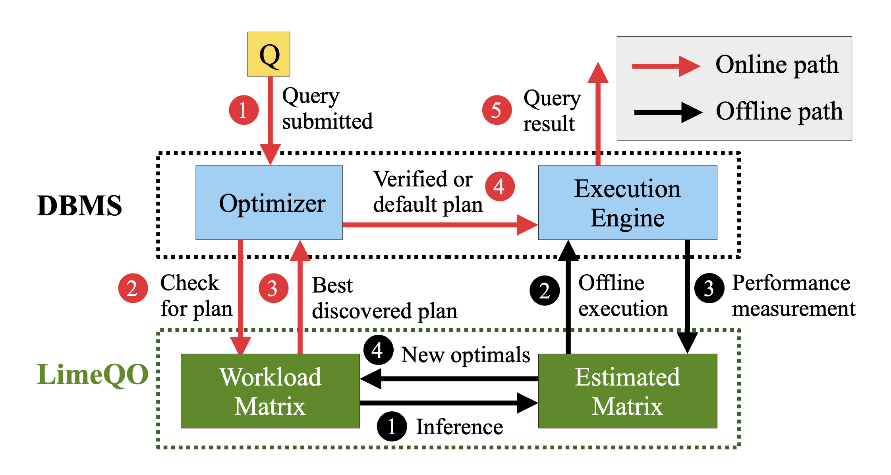
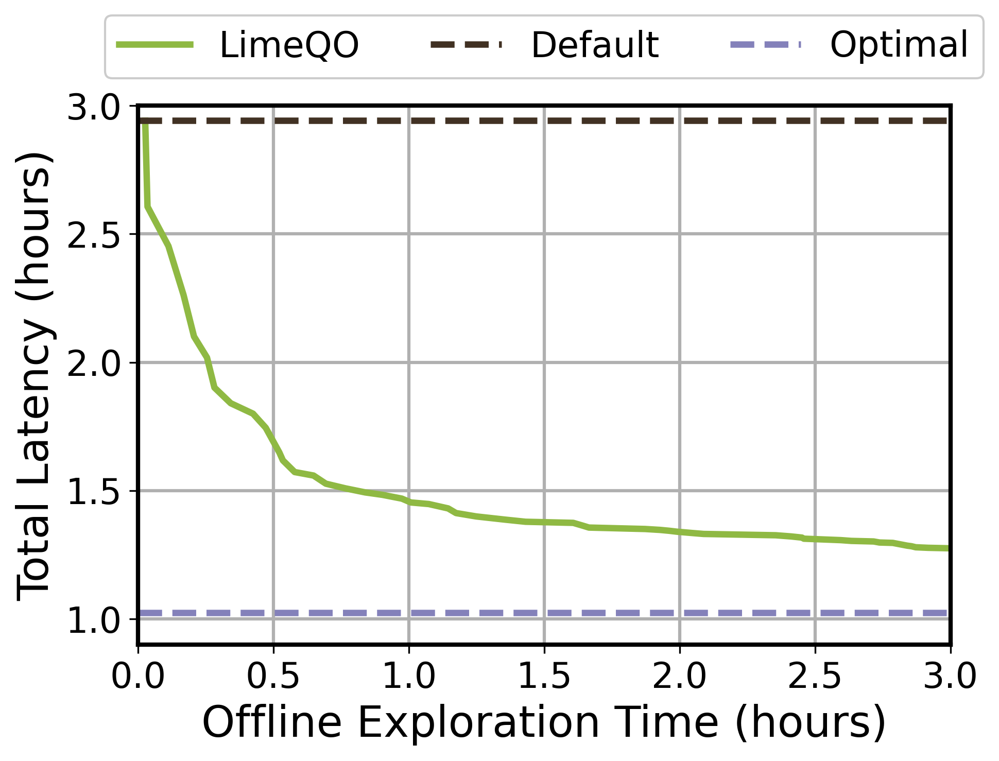

# 🟢🍋 LimeQO: Low Rank Learning for Offline Query Optimization

### 🌟 Overview

LimeQO is a novel offline query optimizer that leverages low-rank structure in the workload matrix to optimize query performance efficiently.

<details>
  <summary>What is the workload matrix?</summary>

- Each **row** represents a **query**.
- Each **column** represents a **hint** (e.g., _disable Nested Loop Join_).
- Each **cell** represents the **runtime** of the query under the given hint (in seconds).
</details>

<details>
  <summary>Offline query optimization?</summary>

  - **What**: Effectively explore alternative query execution plans offline, in a way that minimizing total workload runtime while minimizing offline computation time.
  - **Why**: Focus on repetitive workloads and prevent regression.
  - **How**: Explores optimal plans within the available query hint space by **steering** the existing query optimizer.
  
</details>

<details>
  <summary>How LimeQO works in one sentence?</summary>

  - LimeQO uses ALS (Alternating Least Squares) algorithm to predict the runtime, then leverages the completed workload matrix to efficiently select query hints for offline exploration.
</details>

#### 🚩Features:
  - ✅ **Simple implementation**: Utilizes a straightforward matrix factorization algorithm (ALS). DO NOT need any featurization!
  - ✅ **Low overhead**: Negligible additional computation time.
  - ✅ **High performance**: Achieves **2x speedup** within just one hour.


### 🔗 Dataset

Download dataset from [dropbox](https://www.dropbox.com/scl/fo/y4e88tmcx7ywo4ou1unnh/ABN6iqV1t_ecktO51gsPKRc?rlkey=hedjnmkpak3r3gxjzx48s9etu&st=uxnr4s17&dl=0). This dataset contains the four workload we used in the experiments: ceb, job, stack, and dsb. Each zip  includes query runtimes and corresponding `EXPLAIN` plans for all queries and hints.
```bash
wget -O dataset/qo_dataset.zip "https://www.dropbox.com/scl/fo/y4e88tmcx7ywo4ou1unnh/ABN6iqV1t_ecktO51gsPKRc?rlkey=hedjnmkpak3r3gxjzx48s9etu&st=uxnr4s17&dl=1"
unzip dataset/qo_dataset.zip -d dataset/
rm dataset/qo_dataset.zip
```

### 📂 Project Structure 

```
.
├── dataset/              # Workload datasets (CEB, JOB, Stack, DSB)
├── src/                  
│   ├── data/             # Data loading and preprocessing
│   ├── models/           # Core LimeQO implementation
│   ├── utils/            # Helper functions and utilities
│   └── strategies/       # Optimization strategies: Random, Greedy, LimeQO, LimeQO+
│   └── run_experiment.py # Run main experiments
├── draw/                 # Figures and visualizations
├── experiment/           # Experiment results
└── limeqo.ipynb          # Interactive demo notebook
```

### 🚀 Try LimeQO! 
Check out the interactive demo in [`limeqo.ipynb`](limeqo.ipynb) to see how LimeQO works! Achieve **2x speedup** in just less than 1 hour! ⬇️


